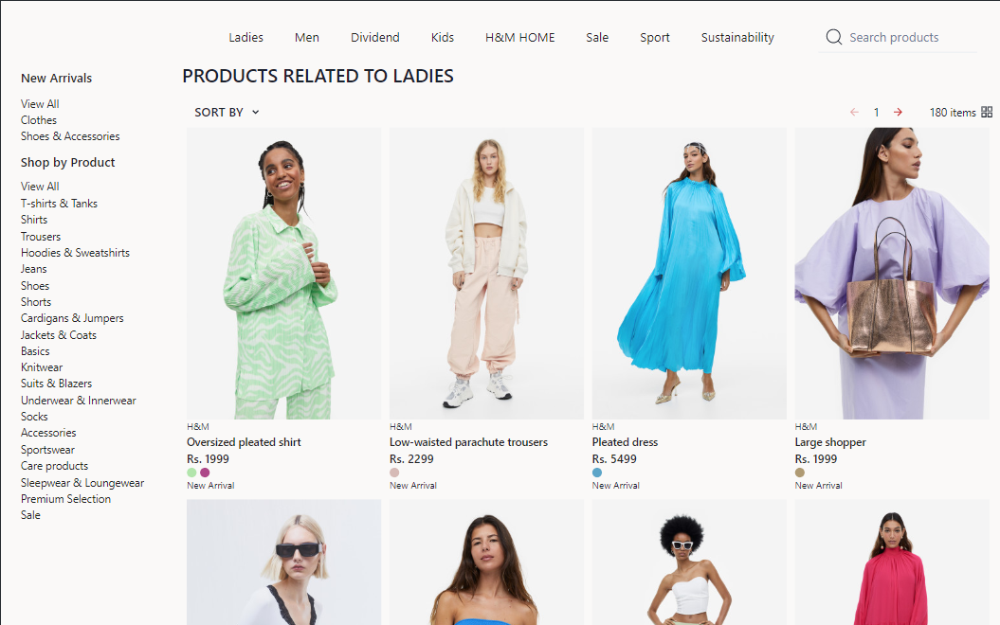

<h1 align="center">ApniDukan</h1>

<h3 align="center">H & M Hennes & Mauritz AB or H&M Group (abbreviated H&M) is a multinational clothing company based in Sweden that focuses on fast-fashion clothing for men, women, teenagers, and children</h3>

 

## 📃 Table of Content

- | **[Installation ](#installation)**
- | **[Tech Stacks ](#tech-stacks)**
- | **[Screens ](#screens)**
- | **[Features ](#features)**
- | **[SnapShots for Different Screen Sizes ](#snapshots-for-different-screen-sizes)**
- | **[SnapShots of Website](#snapShots-of-website)**
- | **[Contributing ](#contributing)**
- | **[Contact ](#contact)**

## Installation

To install the project on your local machine, please follow these steps:

1. Clone the repository: `git clone https://github.com/Piryanshu88/ApniDukan.git`
2. Navigate to the project directory: `cd Client/apnidukan`
3. Install the necessary dependencies: `npm i`
4. Start the development server: `npm start`

## Usage

Once you have installed the project and started the development server, you can view the website at http://localhost:3000/.

The website is a clone of the official H&M website, so you can browse through the different sections and products just like you would on the real website.

## Tech Stacks

<h4 align="center">Frontend:</h4>

  
  
  
  
  
  
  

<h4 align="center">Backend:</h4>

 
  
  
  

<h4 align="center">Deployed On:</h4>

  
  

<h3 align="center"><a href="https://hennes-mauritz-clone.netlify.app/"><strong>Want to see live preview »</strong></a></h3>

<h3 align="center"><a href=""><strong>Demo Video »</strong></a></h3>

 

   &#10023;
  <a href="#The-Little-AI">Getting Started</a> &#10023; 

 

### Screens

- 🏡 Homepage / Landing Page
- 🍎 Products Page
- 👽 SignUp /login Page
- 👨🏽 Single product Page
- ✅ Cart
- 🚀 Checkout Page
- 🌋 404 page

 

## Features

- User authentication: users can sign up and log in to the platform
- Product browsing: customers can browse products based on category and price
- Product details: customers can view detailed information about each product, including images, descriptions
- Shopping cart: customers can add products to their shopping cart and proceed to checkout
- Register || Login
- Fully responsive for all the screen sizes

 

## SnapShots for Different Screen Sizes :

<table>
  <tr>
    <td>
        <h2>For Laptops</h2>
    </td>
  </tr>
  <tr>
    <td  align="center" ></td> 
  </tr>

  <tr>
    <td>
        <h2>For Tabs</h2>
    </td>
  </tr>
  <tr>
    <td  align="center"></td>
  </tr>

  <tr>
    <td>
        <h2>For Mobile Devices</h2>
    </td>
  </tr>
  <tr>
    <td  align="center"></td>
  </tr>

  </table>

## SnapShots of Website

<table>
  <tr>
    <td  align="center"></td>
    <td  align="center"></td>
  </tr>
  <tr>
    <td  align="center"></td>
    <td  align="center"></td>
  </tr>
  <tr>
    <td  align="center"></td>
    <td  align="center"></td>
  </tr>
</table>

## Contributing

We welcome contributions from anyone interested in improving this project. If you would like to contribute, please follow these steps:

-- Fork the repository

1. Create a new branch: git checkout -b my-feature-branch
2. Make your changes and commit them: git commit -m 'Add some feature'
3. Push to the branch: git push origin my-feature-branch
4. Submit a pull request

We will review your contribution and merge it if it meets our standards. Thank you for your interest in contributing to this project!

## Contact

If you want to contact me, you can reach me through below handles.  

© 2023 Piryanshu Bisht

## Show your support

Give a ⭐️ if you like this project!
